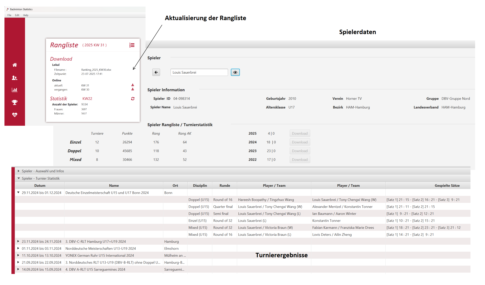
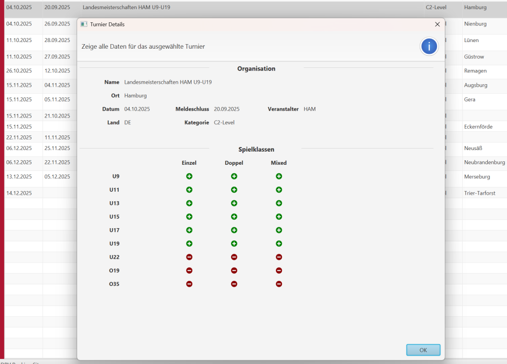
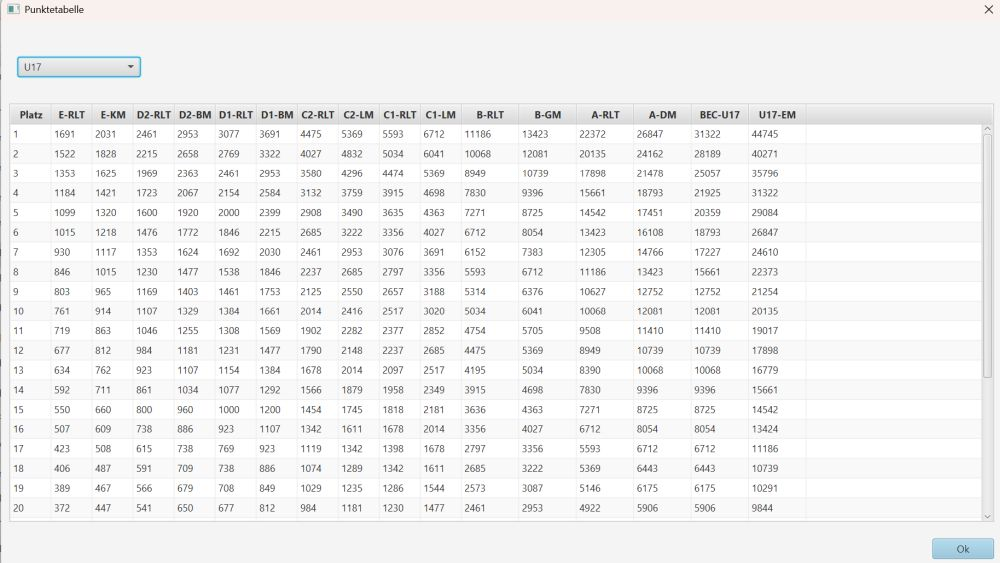

# Badminton Spieler Statistik 
## Was?
+ Wo finde ich schnell alle Daten (Spieler-ID, Verein, Landesverband, Altersklasse) zu einem Spieler? 
+ Wie bekomme ich den aktuellen Punktestand und die Platzierung in der Rangliste wöchentlich aktualisiert?
+ Wie kann ich schnell die Turnierergebnisse meiner Spieler auf einen Blick sehen? 

## Warum? 
Alle Daten zu den Spielern sind im Internet verteilt natürlich auf zufinden. In erster Linie auf Turnier.de.  Sucht man hier jedoch gleichzeitig noch nach Ranglistenplatzierung, der aktuellen Position in der Altersklasse oder generell wird es schon etwas aufwändiger. Will man einen Spieler anmelden und bekommt den Namen eines Partners oder einer Partnerin aus einem anderen Verein oder Landesverband, beginnt die Suche erneut. 

## Wie? 
`bad-stat`ist ein persönliches Hobbyprojekt, entstanden aus der langjährigen Erfahrung mit unserem Sohn, sowohl im nationalen als auch internationalen Bereich. Für mich ist es ein Lernprojekt mit einer (für mich) neuen Technologie ([Quarkus](https://quarkus.io/)) und der Herausforderung, maschinell erstellte HTML Seiten zu parsen. :-)

## Womit?
Jetzt wird es ein wenig technisch :-)
+ Java
+ Quarkus
+ HtmlUnit
+ JavaFX

# Screenshots

+ Alle Infomationen zur Rangliste eines Spielers oder einer Spielerin

+ Alle Informationen zu den noch anstehenden Turnieren im aktuellen und kommenden Jahr
+ Es können folgende Filter genutzt werden:
  + **Zeit**: alle Turniere, noch verbleibende Turniere, Turniere im kommenden Jahr
  + **Altersklasse**: die Standard Altersklassen bei Badminton bei Turniere.de
  + **Kategorie**: die Standard Kategorien von A-E Rangliste, sowie BEC und BWF Turniere die bei Turnier.de gelistet sind
  

+ Kontextmenu zur Anzeige der gespielten Disciplinen eines Turniers

+ Kontextmenu zur Anzeige der Ranglistenpunkte für die ausgewählte Altersklasse und den verschiedenen Turnieren

